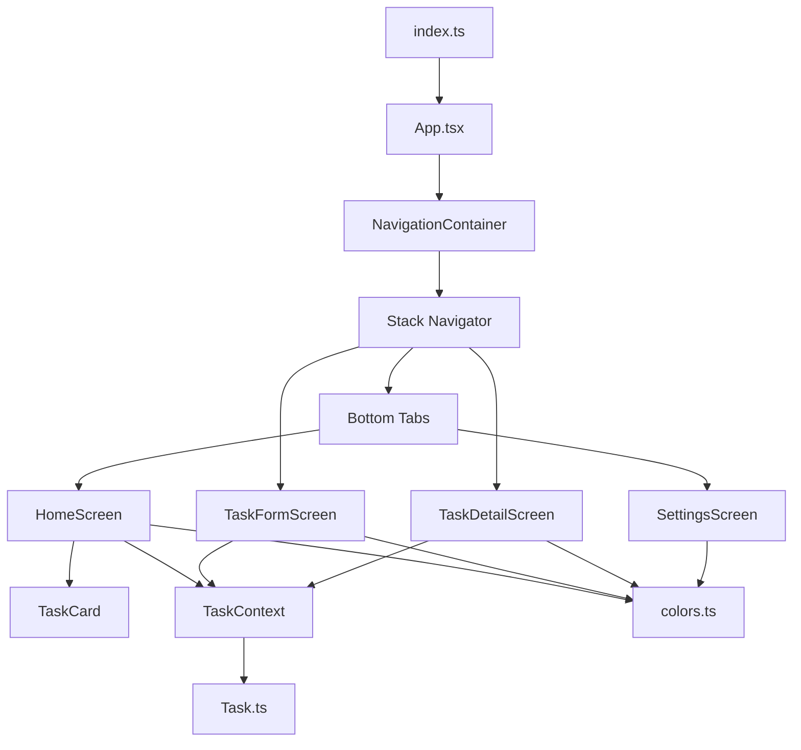

# 📋 Gestor de Tareas

> Aplicación móvil desarrollada con **React Native**, **Expo** y **TypeScript** para la gestión de tareas personales mediante operaciones CRUD (Crear, Leer, Actualizar y Eliminar). La aplicación cuenta con una interfaz moderna, navegación mediante Stack y Bottom Tabs, validaciones de formularios y una pantalla para visualizar el detalle de cada tarea.


---

# Nombre de la aplicación

**Gestor de Tareas** — Versión **1.0.0**

---

# Tecnologías utilizadas

- React Native
- Expo
- TypeScript
- React Navigation
- Context API
- Expo Vector Icons

---

# Características

- Crear tareas.
- Editar tareas.
- Eliminar tareas.
- Visualizar el detalle completo de una tarea.
- Validación de campos obligatorios.
- Navegación entre pantallas.
- Barra de navegación inferior.
- Diseño moderno y responsive.
- Manejo del estado mediante Context API.

---

# Comandos para ejecutar el proyecto

## 1. Instalar dependencias

```bash
npm install
```

Instala todas las dependencias necesarias para ejecutar la aplicación.

---

## 2. Ejecutar el proyecto

```bash
npx expo start
```

Inicia el servidor de Expo.

---

## 3. Ejecutar mediante Expo Go

```bash
npx expo start --tunnel
```

La opción **--tunnel** permite probar la aplicación incluso cuando el dispositivo móvil no se encuentra en la misma red.

---

# Estructura del proyecto

```text
ParcialAM
│
├── assets
│
├── src
│   │
│   ├── components
│   │   └── TaskCard.tsx
│   │
│   ├── context
│   │   └── TaskContext.tsx
│   │
│   ├── models
│   │   └── Task.ts
│   │
│   ├── screens
│   │   ├── HomeScreen.tsx
│   │   ├── SettingsScreen.tsx
│   │   ├── TaskDetailScreen.tsx
│   │   └── TaskFormScreen.tsx
│   │
│   ├── theme
│   │   └── colors.ts
│   │
│   ├── types
│   │   └── navigation.ts
│   │
│   └── utils
│       ├── helpers.ts
│       └── validators.ts
│
├── App.tsx
├── app.json
├── index.ts
├── package.json
├── package-lock.json
├── tsconfig.json
└── README.md
```

---

# Descripción de la estructura

## assets

Contiene los recursos gráficos utilizados por Expo, como el ícono de la aplicación y la pantalla Splash.

---

## components

Contiene los componentes reutilizables de la aplicación.

| Archivo | Descripción |
|----------|-------------|
| **TaskCard.tsx** | Tarjeta reutilizable que representa cada tarea mostrando el título, una parte de la descripción y los botones para visualizar, editar y eliminar. |

---

## context

Contiene el estado global de la aplicación.

| Archivo | Descripción |
|----------|-------------|
| **TaskContext.tsx** | Administra todas las tareas mediante Context API, proporcionando las funciones para agregar, editar y eliminar tareas. |

---

## models

Contiene los modelos de datos.

| Archivo | Descripción |
|----------|-------------|
| **Task.ts** | Define la interfaz de una tarea con sus propiedades: id, título y descripción. |

---

## screens

Contiene todas las pantallas principales.

| Archivo | Descripción |
|----------|-------------|
| **HomeScreen.tsx** | Pantalla principal donde se muestran todas las tareas registradas. Desde aquí también se pueden crear, editar, eliminar y visualizar tareas. |
| **TaskFormScreen.tsx** | Formulario utilizado para registrar nuevas tareas o modificar una existente. |
| **TaskDetailScreen.tsx** | Pantalla encargada de mostrar el contenido completo de una tarea cuando su descripción es demasiado extensa. |
| **SettingsScreen.tsx** | Pantalla de ajustes de la aplicación. |

---

## theme

Contiene la configuración visual de la aplicación.

| Archivo | Descripción |
|----------|-------------|
| **colors.ts** | Centraliza todos los colores utilizados para mantener un diseño uniforme en toda la aplicación. |

---

## types

Contiene los tipos utilizados por TypeScript.

| Archivo | Descripción |
|----------|-------------|
| **navigation.ts** | Define los tipos de navegación del Stack Navigator y Bottom Tab Navigator. |

---

## utils

Contiene funciones auxiliares.

| Archivo | Descripción |
|----------|-------------|
| **helpers.ts** | Funciones de apoyo utilizadas por diferentes componentes de la aplicación. |
| **validators.ts** | Contiene las funciones encargadas de validar los datos ingresados por el usuario en los formularios. |

---

## App.tsx

Es el archivo principal de la aplicación.

Aquí se configura:

- NavigationContainer
- Stack Navigator
- Bottom Tab Navigator
- TaskProvider

También registra las pantallas:

- Home
- Formulario
- Detalle
- Ajustes

---

## index.ts

Punto de entrada de React Native.

Su función consiste en cargar el componente principal **App.tsx**.

---

## app.json

Contiene la configuración general de Expo.

Entre ella:

- Nombre
- Ícono
- Splash
- Orientación
- Configuración del proyecto

---

## package.json

Define:

- Dependencias
- Scripts
- Información del proyecto

---

## tsconfig.json

Contiene la configuración del compilador TypeScript.

---

# Flujo de funcionamiento



---

# Relación entre los archivos

1. La aplicación inicia desde **index.ts**.

2. **App.tsx** configura toda la navegación utilizando Stack Navigator y Bottom Tabs.

3. Todas las pantallas se encuentran envueltas por **TaskProvider**, permitiendo compartir el estado de las tareas.

4. **HomeScreen** obtiene las tareas desde **TaskContext** y las representa mediante el componente **TaskCard**.

5. Cada **TaskCard** permite visualizar, editar o eliminar una tarea.

6. Si la descripción es muy extensa, el usuario puede abrir **TaskDetailScreen** para visualizar el contenido completo.

7. **TaskFormScreen** utiliza el mismo contexto para registrar nuevas tareas o actualizar las existentes.

8. Las validaciones del formulario son realizadas mediante **validators.ts**.

9. Los colores utilizados por toda la aplicación se encuentran centralizados en **theme/colors.ts**, garantizando un diseño uniforme.

---

# Librerías utilizadas

| Librería | Función |
|----------|----------|
| react | Desarrollo mediante componentes. |
| react-native | Componentes nativos como View, Text, FlatList, TouchableOpacity y TextInput. |
| expo | Ejecución y compilación del proyecto. |
| typescript | Tipado estático del proyecto. |
| @react-navigation/native | Administración de la navegación. |
| @react-navigation/native-stack | Navegación tipo Stack entre pantallas. |
| @react-navigation/bottom-tabs | Barra de navegación inferior. |
| @expo/vector-icons | Íconos utilizados en la interfaz. |

---

# Funcionalidades implementadas

- ✅ Crear tareas.
- ✅ Editar tareas.
- ✅ Eliminar tareas.
- ✅ Visualizar detalle completo de una tarea.
- ✅ Validación de formularios.
- ✅ Navegación Stack.
- ✅ Bottom Tabs.
- ✅ Context API.
- ✅ TypeScript.
- ✅ Componentes reutilizables.
- ✅ Diseño responsive.

---

# Integrantes

- **Yrsa Cueto**
- **Alessander Guillén**
- **Salvinia Palomino**

---

<p align="center">
Proyecto Académico — Desarrollo de Aplicaciones Móviles<br>
Gestor de Tareas v1.0.0
</p>