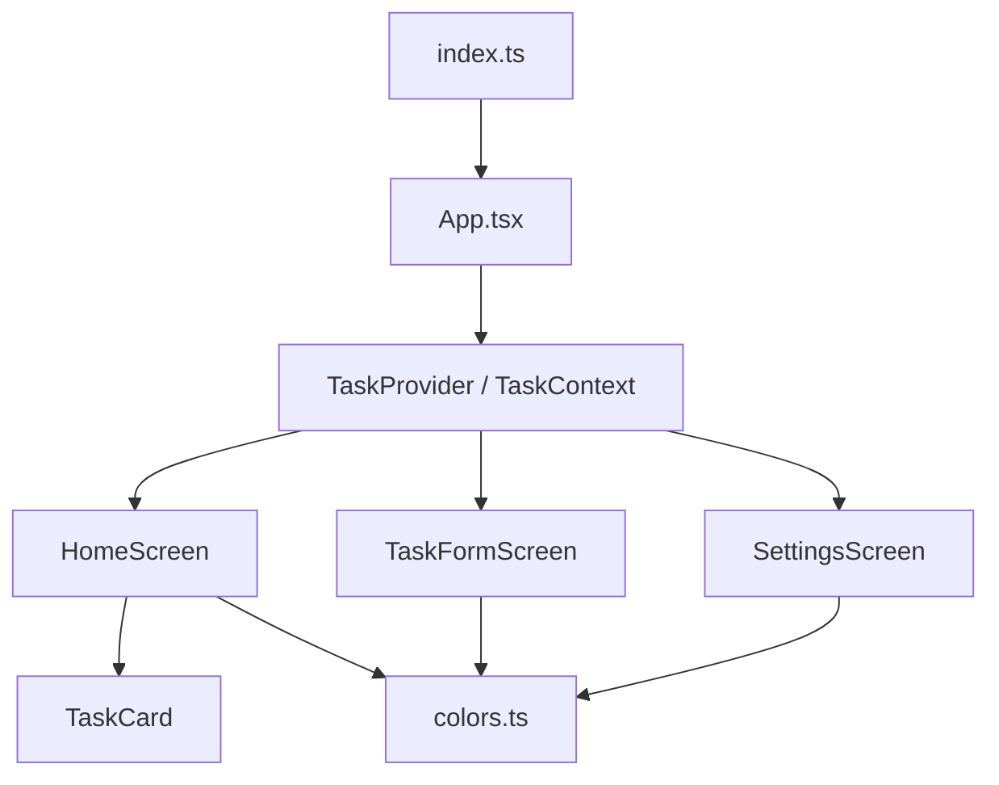

# 📋 Gestor de Tareas

> Aplicación móvil desarrollada con **React Native** y **Expo** para la gestión de tareas personales mediante operaciones CRUD (crear, leer, editar y eliminar).


---

## Nombre de la aplicación

**Gestor de Tareas** — Versión `1.0.0`

---

## Comandos para ejecutar el proyecto

### 1. Instalar las dependencias

```bash
npm install
```

Instala todas las dependencias definidas en `package.json`. **Debe ejecutarse primero**, inmediatamente después de descargar el proyecto.

### 2. Iniciar el proyecto

```bash
npx expo start
```

Inicia el servidor de desarrollo de Expo y genera un código QR para ejecutar la aplicación desde un dispositivo móvil o un emulador.

### 3. Ejecutar con Expo Go

```bash
npx expo start --tunnel
```

También puede usarse la opción estándar:

```bash
npx expo start
```

> La opción `--tunnel` permite conectarse mediante Expo Go cuando el dispositivo no detecta la red local, o cuando se desea probar la aplicación desde otra conexión.

---

## Estructura del proyecto

```
src
│
├── components
│   └── TaskCard.tsx
│
├── context
│   └── TaskContext.tsx
│
├── models
│   └── Task.ts
│
├── screens
│   ├── HomeScreen.tsx
│   ├── SettingsScreen.tsx
│   └── TaskFormScreen.tsx
│
└── utils
    └── colors.ts

App.tsx
app.json
index.ts
package.json
package-lock.json
tsconfig.json
```

---

## Descripción de la estructura

### `assets`
Contiene los recursos visuales de la aplicación, como los íconos y la pantalla de inicio (*Splash Screen*). Estos recursos son utilizados por `app.json`.

### `components`
Contiene los componentes reutilizables.

| Archivo | Descripción |
|---|---|
| `TaskCard.tsx` | Muestra cada tarea con su título, descripción y los botones para editar o eliminar. |

### `context`
Contiene la lógica principal de la aplicación.

| Archivo | Descripción |
|---|---|
| `TaskContext.tsx` | Administra las tareas mediante las operaciones de agregar, editar y eliminar. |

### `models`
Contiene los modelos de datos.

| Archivo | Descripción |
|---|---|
| `Task.ts` | Define la estructura de una tarea mediante su `id`, `título` y `descripción`. |

### `screens`
Contiene las pantallas principales de la aplicación.

| Archivo | Descripción |
|---|---|
| `HomeScreen.tsx` | Muestra todas las tareas registradas y permite agregar, editar o eliminar una tarea. |
| `TaskFormScreen.tsx` | Contiene el formulario para registrar o modificar una tarea y valida que los campos no estén vacíos. |
| `SettingsScreen.tsx` | Muestra la pantalla de ajustes de la aplicación. |

### `utils`
Contiene archivos de apoyo.

| Archivo | Descripción |
|---|---|
| `colors.ts` | Centraliza la paleta de colores utilizada en toda la aplicación. |

### `App.tsx`
Archivo principal del proyecto. Aquí se configura la navegación mediante *Stack* y *Bottom Tabs*, además de envolver la aplicación con `TaskProvider`.

### `index.ts`
Punto de entrada de React Native. Su función es cargar el archivo `App.tsx`.

### `app.json`
Contiene la configuración general de la aplicación, como el nombre, la versión, el ícono y la pantalla de inicio.

### `package.json`
Contiene la información del proyecto, las dependencias instaladas y los scripts necesarios para ejecutarlo.

---

## Relación entre los archivos



1. El proyecto **inicia en `index.ts`**, el cual carga `App.tsx`.
2. En `App.tsx` se configura la navegación y se envuelve toda la aplicación con `TaskProvider`.
3. Las pantallas `HomeScreen`, `TaskFormScreen` y `SettingsScreen` utilizan `TaskContext` para acceder a las funciones del CRUD.
4. Cuando se muestran las tareas, `HomeScreen` utiliza el componente `TaskCard` para representar cada una de ellas.
5. Finalmente, todas las pantallas utilizan los colores definidos en `colors.ts`, manteniendo un diseño uniforme en toda la aplicación.

---

## Librerías utilizadas

| Librería | Función |
|---|---|
| `react` | Permite desarrollar la aplicación mediante componentes y administrar el estado de la interfaz. |
| `react-native` | Proporciona los componentes nativos como `View`, `Text`, `TextInput` y `FlatList`. |
| `expo` | Facilita la ejecución y las pruebas de la aplicación mediante Expo Go. |
| `@react-navigation/native` | Administra la navegación entre las pantallas. |
| `@react-navigation/native-stack` | Implementa la navegación tipo *Stack* entre `HomeScreen` y `TaskFormScreen`. |
| `@react-navigation/bottom-tabs` | Crea la barra de navegación inferior entre *Tareas* y *Ajustes*. |
| `@expo/vector-icons` | Proporciona los íconos utilizados en la aplicación. |

---

## Integrantes

- Yrsa Cueto
- Alessander Guillén
- Salvinia Palomino

---

<p align="center">Proyecto académico — Gestor de Tareas v1.0.0</p>
